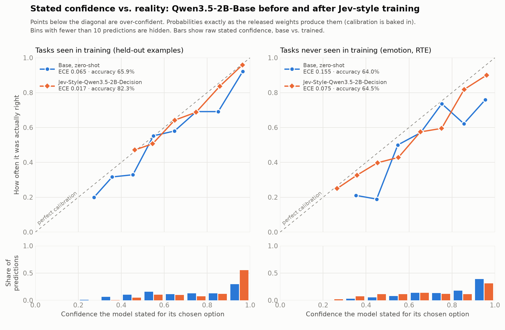

> **Jev-Style v3 is available — smaller and stronger:** [Jev-Style-0.8B-Decision-v3-MLX](https://huggingface.co/chaoliangUNSW/Jev-Style-0.8B-Decision-v3-MLX) scores **79.2%** on the 2,000 typed decisions (v1: 53.4%, v2: 73.5%, as reported on the v2 card), takes **25,600-token** inputs, works across **51 languages** and scores options without the 26-letter cap (tested with 77 options), all at **0.8B** parameters. This repository preserves v1; v2 is [here](https://huggingface.co/chaoliangUNSW/Jev-Style-Qwen3.5-2B-Decision-v2-MLX-bf16).


# Jev-Style-Qwen3.5-2B-Decision (MLX, bf16)

**Website:** [jevstyle.com](https://jevstyle.com/#v1) — all JevStyle decision models, benchmarks and quickstart in one place.

A **Jev-style decision model**: it does not write text. Give it a state, a question and a list of options, and one forward pass returns the decision **with calibrated probabilities** - in 77 ms on an M1 Max.

GGUF builds (BF16 / Q8_0 / Q4_K_M) for LM Studio and llama.cpp: [chaoliangUNSW/Jev-Style-Qwen3.5-2B-Decision-GGUF](https://huggingface.co/chaoliangUNSW/Jev-Style-Qwen3.5-2B-Decision-GGUF)

## Results

Everything below is measured on data the model never trained on, with the probabilities **exactly as the released weights produce them** (no post-processing).

| | Qwen3.5-2B-Base, zero-shot | **This model** |
|---|---|---|
| Accuracy, 5 decision tasks (1,500 held-out examples) | 65.9% | **82.3%** |
| Calibration error (ECE) on those tasks | 0.065 | **0.017** |
| Negative log-likelihood / Brier score | 0.786 / 0.446 | **0.418 / 0.242** |
| Calibration error on task types never seen in training | 0.155 | **0.075** |
| Latency per decision (M1 Max, MLX bf16) | 76 ms | **77 ms** (no added cost) |

- **Calibrated out of the box.** An ECE of 0.017 on 1,500 examples is statistically indistinguishable from a *perfectly* calibrated model: simulating labels from the model's own probabilities gives an expected ECE of 0.017 (95th percentile 0.025) from sampling noise alone. When this model says 80%, it is right about 80% of the time.
- **Large accuracy gains where the base model struggled:** MNLI 52.3% -> 86.7%, SST-5 32.0% -> 61.7%, BoolQ 73.0% -> 82.7%, SST-2 87.3% -> 92.7%, AG News 84.7% -> 87.7%.
- **Calibration transfers to new task types:** on emotion classification and RTE (never seen in training) the calibration error is halved (0.155 -> 0.075) at unchanged accuracy (64.5%).
- **Zero-cost calibration.** A temperature fitted on 4,366 held-out examples is folded into the final RMSNorm weight, so every logit is already calibrated. Nothing to apply at inference time.
- **Quantisation-friendly.** Q8_0 makes the same decision as bf16 on 99.4% of examples; Q4_K_M (1.3 GB) keeps 82.4% accuracy.
- **Efficient training recipe.** LoRA rank 16 on all linear layers with a log-score loss, built on a custom chunk-parallel, differentiable Gated DeltaNet forward that matches the per-token training path to 1e-6 (outputs, state and all gradients) and is 6.5x faster per step (measured on the 0.8B sibling model).


## What "Jev-style" means

[Jev](https://typesafe.ai/blog/introducing-system-one-models-and-jev) (TypeSafe AI, 2026) introduced *System One* models: instead of generating text, the model takes a state plus a typed question and returns a **decision with calibrated probabilities** in a single pass. This model follows that pattern on top of an open base model:

- **Choice** - pick one of N declared options, with a probability for each
- **Bool** - probability that a proposition is true
- **Score** - a distribution over ordered levels, and its expectation as a continuous score

It cannot answer outside the declared options, it does not decode text, and one prefill pass gives the whole distribution.

> This is an independent, from-scratch reproduction of the publicly described idea. It is not affiliated with TypeSafe AI and is not the Jev model.

## Quick start (Apple Silicon)

> **Important: you must use the [prompt format](#prompt-format) below. Plain chat messages produce meaningless text continuation.**
> This is a decision function, not a chat model. In a chat window, paste the full prompt (it must end with `Answer:`) and start a new chat for every decision.

```bash
pip install mlx-lm
python jev_style_mlx.py
```

```python
from jev_style_mlx import JevStyle

jev = JevStyle()  # downloads this repo on first use
jev.decide("Shares of the chipmaker jumped 8% after it raised its revenue forecast.",
           "Which news section does this article belong to?",
           ["World", "Sports", "Business", "Science/Technology"])
# [('Business', 0.70), ('Science/Technology', 0.29), ('World', 0.005), ('Sports', 0.002)]

jev.decide_bool("Premise: A man is playing a guitar on stage.\nHypothesis: Someone is performing music.",
                "Does the premise entail the hypothesis?")
# 0.976

jev.decide_score("The plot is thin, but the two leads are so charming that I left the cinema smiling.",
                 "Rate the sentiment of this review on an ordered scale.",
                 ["very negative", "negative", "neutral", "positive", "very positive"])
# (3.05, [... ('positive', 0.68), ('very positive', 0.21)])
```

**LM Studio:** the model loads with the MLX engine and answers with the option letter in the chat window. LM Studio's MLX engine does not return token log-probs, so to read the probabilities inside LM Studio use the [GGUF build](https://huggingface.co/chaoliangUNSW/Jev-Style-Qwen3.5-2B-Decision-GGUF) with `jev_style_client.py`, or use `jev_style_mlx.py` above.

## Prompt format

```
You are a decision function. Read the state, then answer the question by choosing exactly one option.

[State]
{state}

[Question]
{question}

[Options]
A. {option 1}
B. {option 2}

Answer:
```

The next token is the option letter (` A`, ` B`, ...). Its probability, renormalised over the declared letters, is the decision distribution. For **Score**, list the levels in order; for **Bool**, use `yes` / `no`. The repository ships a pass-through chat template, so chat endpoints and the LM Studio chat window pass this text to the model verbatim.
## Scope

- A decision function, not a chat model: send the prompt format above.
- Trained on five English task families (sentiment, natural-language inference, topic, yes/no question answering, 5-level rating). On unseen task types it keeps the base model's accuracy with better, though not perfect, calibration.
- Up to 26 options (20 when probabilities are read through a server's `top_logprobs`).

## Training data and licence

SST-2 and MNLI (GLUE), AG News, BoolQ and SST-5, 22k examples converted to typed decisions; 80% for LoRA training, 20% held out for the calibration temperature. AG News is distributed for research / non-commercial use. Weights: Apache-2.0, same as [Qwen/Qwen3.5-2B-Base](https://huggingface.co/Qwen/Qwen3.5-2B-Base).

## Contact

I welcome internship, employment, and research collaboration opportunities. Please contact me at [**yanchaoliang369@gmail.com**](mailto:yanchaoliang369@gmail.com).

欢迎提供实习、工作及科研合作机会，请邮件联系：[yanchaoliang369@gmail.com](mailto:yanchaoliang369@gmail.com)。
